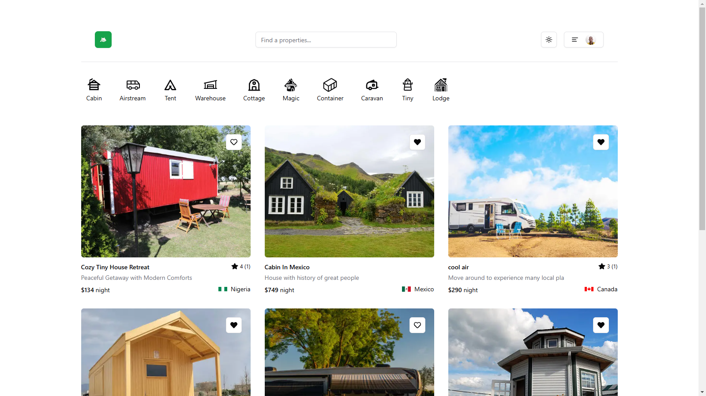
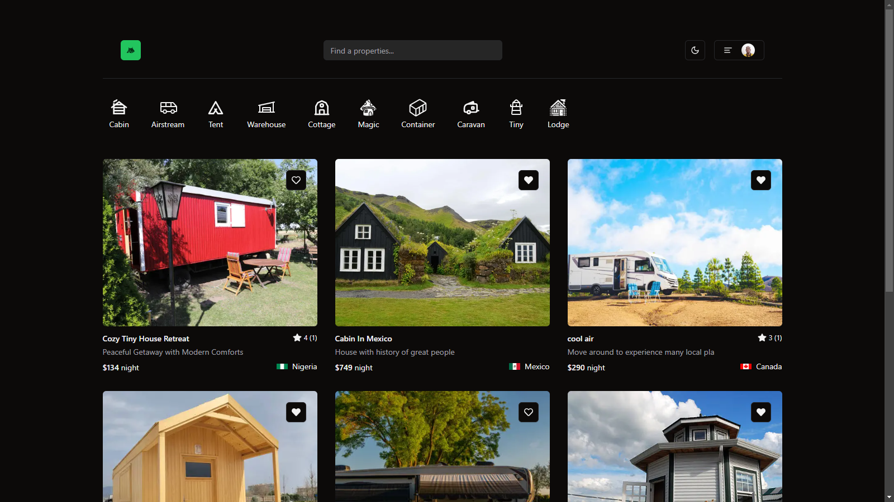
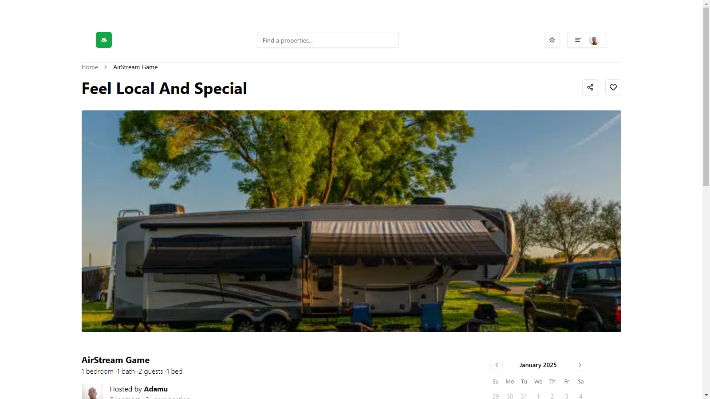

# 🏡 Host-House: Lease or rent house

## 🚀 Host-House is a full-featured vacation rental platform inspired by solving problem facing people who look for new space in my community. It allows users to list properties, book stays, manage reservations, and authenticate securely.

### 🔧 Tech Stack

- Next.js: Framework for server-side rendering and routing
- TypeScript: Type safety and better developer experience
- Tailwind CSS: Styling for a modern and responsive UI
- ShadCN: UI components with a sleek design
- Zod: Schema validation for forms and API requests
- Supabase: Database and authentication backend
- Clerk: Authentication and user management
- Prisma: ORM for managing database interactions

### ✨ Features

- ✅ User Authentication & Authorization (Sign in / Sign up with Clerk)
- ✅ Property Listings (Add, edit, and manage listings)
- ✅ Booking System (Users can book stays & manage reservations)
- ✅ Search & Filtering (Find listings based on location, price, and amenities)
- ✅ Image Uploads (Upload property images seamlessly)
- ✅ Responsive & Modern UI (Built with Tailwind & ShadCN)
- ✅ Secure & Scalable Backend (Powered by Supabase & Prisma)

### 📸 Some Screenshots

## 📄 License

- This project is licensed under the MIT License

## 📩 Contact

- 📧 Email: GbadegesinRidwan611@gmail.com
- 🐙 GitHub: Gesin1
- 🔗 Live Demo: host-house.vercel.app
